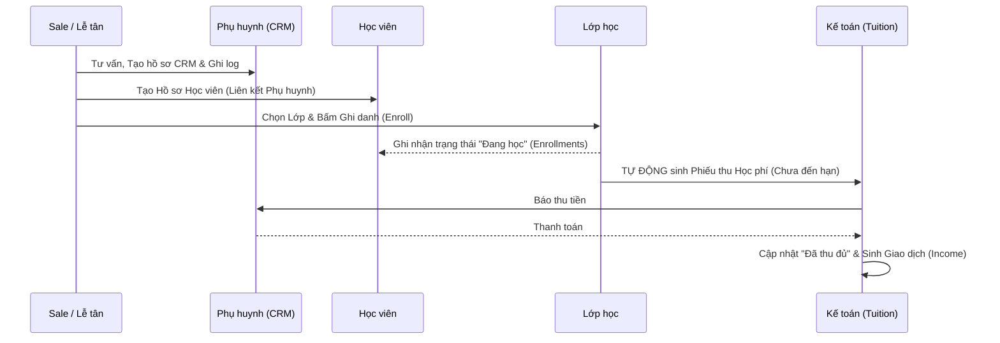
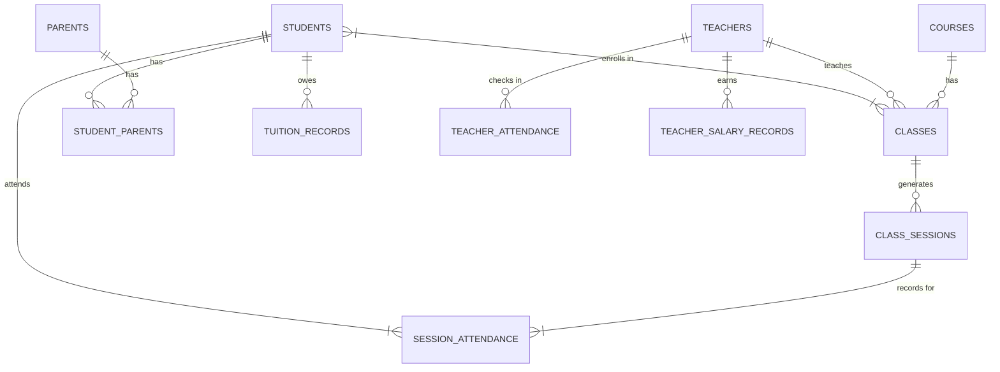

# Đánh giá Nghiệp vụ Trung tâm Tiếng Anh & Sơ đồ Luồng dữ liệu

Dựa trên cấu trúc Database và các luồng xử lý hiện tại (sau khi đã vá các lỗ hổng), hệ thống của bạn đã đáp ứng được **khoảng 85-90%** các nghiệp vụ cốt lõi của một trung tâm Tiếng Anh quy mô vừa và nhỏ.

## 1. Đánh giá Mức độ Hoàn thiện Nghiệp vụ

### Những điểm mạnh (Đã làm rất tốt):
*   **CRM Phụ huynh đa liên kết:** Cho phép 1 phụ huynh quản lý nhiều học viên (anh chị em), có đánh giá tiềm năng (Lead scoring) và lưu lại nhật ký tương tác (Tư vấn, Gọi điện). Rất tốt cho Sale.
*   **Chống trùng lịch (Conflict Prevention):** Tính năng tự động quét xem Giáo viên đó, Phòng học đó có bị trùng giờ ở một lớp khác không là tính năng "sống còn" đối với khâu vận hành.
*   **Quản trị Giáo viên toàn diện:** Không chỉ quản lý lịch dạy, hệ thống còn quản lý bằng cấp, đánh giá chất lượng KPI (để xét thưởng) và tự động hóa tính lương (theo giờ hoặc theo buổi).
*   **Bảo toàn dữ liệu Kế toán:** Nhờ cơ chế "Xóa mềm", dù học viên/giáo viên có nghỉ thì dòng tiền thu chi lịch sử vẫn khớp sổ.

### Những điểm có thể nâng cấp trong tương lai (Phase 2):
*   **Điểm số & Học bạ (Gradebook):** Hiện tại hệ thống tập trung nhiều vào Quản lý Vận hành & Kế toán, nhưng chưa có bảng lưu Điểm thi (Giữa kỳ, Cuối kỳ) và Nhận xét học lực để gửi báo cáo định kỳ cho Phụ huynh.
*   **Chính sách Khuyến mãi (Voucher/Discount):** Đang lấy giá tiền của lớp gán thẳng thành số tiền học phí phải thu. Nên có thêm ô nhập % giảm giá hoặc số tiền giảm cho anh em ruột học cùng.
*   **Học bù / Chuyển lớp:** Chưa có quy trình chuẩn để một học viên vắng mặt ở lớp này được ghép sang học bù ở một session của lớp khác.

---

## 2. Sơ đồ Luồng dữ liệu (Data Flow Diagrams)

Dưới đây là sơ đồ mô tả cách dòng chảy dữ liệu diễn ra trong hệ thống của bạn.

### A. Luồng Ghi danh & Thu Học phí (Enrollment & Tuition Flow)

Sơ đồ này mô tả cách một khách hàng (Leads) trở thành Học viên và sinh ra dòng tiền.



### B. Luồng Vận hành Học thuật & Tính Lương (Academic & Payroll Flow)

Sơ đồ này thể hiện sự liên kết chặt chẽ giữa việc Xếp lịch -> Dạy học -> Chấm công -> Tính lương.

```mermaid
graph TD
    subgraph 1. Quản lý Đào tạo (Academic)
    C[Khóa học / Course] -->|Định nghĩa| L[Lớp học / Class]
    L -->|Xếp lịch| S[Buổi học / Sessions]
    GV[Giáo viên] -->|Được phân công| S
    Room[Phòng học] -->|Được xếp| S
    end

    subgraph 2. Vận hành Hàng ngày (Operations)
    S -->|Hàng ngày| Att_HV[Điểm danh Học viên]
    S -->|Hàng ngày| Att_GV[Chấm công Giáo viên]
    end

    subgraph 3. Đánh giá & Kế toán (HR & Payroll)
    Att_GV -->|Tổng hợp Giờ / Buổi| PR[Bảng Lương / Payroll]
    KPI[Đánh giá KPI hàng tháng] -->|Thưởng / Phạt| PR
    GV -->|Hệ số Lương| PR
    PR -->|Chi trả| Ledger[Giao dịch Chi phí / Expense]
    end

    classDef default fill:#f9f9f9,stroke:#333,stroke-width:1px;
    classDef highlight fill:#e1f5fe,stroke:#03a9f4,stroke-width:2px;
    class PR highlight
```

### C. Cấu trúc Liên kết CSDL Cốt lõi (ERD Cấp cao)

Đây là bức tranh tổng thể về cách các bảng dữ liệu "bám" vào nhau để duy trì tính toàn vẹn.


